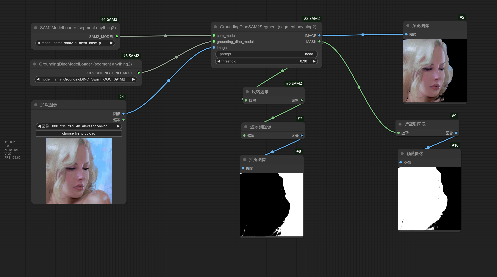

# ComfyUI SAM2(Segment Anything 2)

This project adapts the SAM2 to incorporate functionalities from [comfyui_segment_anything](https://github.com/storyicon/comfyui_segment_anything?tab=readme-ov-file#comfyui-segment-anything). Many thanks to continue-revolution for their foundational work.


You can refer to this example workflow for a quickly try.

## Requirements

Install the necessary Python dependencies with:

```sh
pip install -r requirements.txt
```

## Models

Models will be automatically downloaded when needed. Alternatively, you can download them manually as per the instructions below. If the download is slow, set the `HTTP_PROXY` and `HTTPS_PROXY` environment variables to use a proxy.

### BERT Base Uncased

Download the model from [Hugging Face](https://huggingface.co/bert-base-uncased/tree/main) and place the files in the `models/bert-base-uncased` directory under ComfyUI.

### GroundingDino

Download the models and config files to `models/grounding-dino` under the ComfyUI root directory. Do not modify the file names.

| Name                    | Size  | Config File                                                                                                  | Model File                                                                                                    |
| ----------------------- | ----- | ------------------------------------------------------------------------------------------------------------ | ------------------------------------------------------------------------------------------------------------- |
| GroundingDINO_SwinT_OGC | 694MB | [download link](https://huggingface.co/ShilongLiu/GroundingDINO/resolve/main/GroundingDINO_SwinT_OGC.cfg.py) | [download link](https://huggingface.co/ShilongLiu/GroundingDINO/resolve/main/groundingdino_swint_ogc.pth)     |
| GroundingDINO_SwinB     | 938MB | [download link](https://huggingface.co/ShilongLiu/GroundingDINO/resolve/main/GroundingDINO_SwinB.cfg.py)     | [download link](https://huggingface.co/ShilongLiu/GroundingDINO/resolve/main/groundingdino_swinb_cogcoor.pth) |

### SAM 2

Download the model files to `models/sam2` under the ComfyUI root directory. Do not modify the file names.

**SAM 2.1 checkpoints**
The table below shows the improved SAM 2.1 checkpoints released on September 29, 2024.

| Model                  | Size  | Model File                                                                                          |
| ---------------------- | ----- | --------------------------------------------------------------------------------------------------- |
| sam2.1_hiera_tiny      | 148MB | [download link](https://dl.fbaipublicfiles.com/segment_anything_2/092824/sam2.1_hiera_tiny.pt)      |
| sam2.1_hiera_small     | 176MB | [download link](https://dl.fbaipublicfiles.com/segment_anything_2/092824/sam2.1_hiera_small.pt)     |
| sam2.1_hiera_base_plus | 308MB | [download link](https://dl.fbaipublicfiles.com/segment_anything_2/092824/sam2.1_hiera_base_plus.pt) |
| sam2.1_hiera_large     | 856MB | [download link](https://dl.fbaipublicfiles.com/segment_anything_2/092824/sam2.1_hiera_large.pt)     |

**SAM 2 checkpoints**
The previous SAM 2 checkpoints released on July 29, 2024 can be found as follows:

| Model                | Size    | Model File                                                                                        |
| -------------------- | ------- | ------------------------------------------------------------------------------------------------- |
| sam2_hiera_tiny      | 38.9MB  | [download link](https://dl.fbaipublicfiles.com/segment_anything_2/072824/sam2_hiera_tiny.pt)      |
| sam2_hiera_small     | 46MB    | [download link](https://dl.fbaipublicfiles.com/segment_anything_2/072824/sam2_hiera_small.pt)     |
| sam2_hiera_base_plus | 80.8MB  | [download link](https://dl.fbaipublicfiles.com/segment_anything_2/072824/sam2_hiera_base_plus.pt) |
| sam2_hiera_large     | 224.4MB | [download link](https://dl.fbaipublicfiles.com/segment_anything_2/072824/sam2_hiera_large.pt)     |

### Contribution

Thank you for considering contributions! Fork the repository, make changes, and send a pull request for review and merging.

### Citing SAM 2

If you use SAM 2 or the SA-V dataset in your research, cite the following:

```bibtex
@article{ravi2024sam2,
  title={SAM 2: Segment Anything in Images and Videos},
  author={Ravi, Nikhila and Gabeur, Valentin and Hu, Yuan-Ting and Hu, Ronghang and Ryali, Chaitanya and Ma, Tengyu and Khedr, Haitham and R{\"a}dle, Roman and Rolland, Chloe and Gustafson, Laura and Mintun, Eric and Pan, Junting and Alwala, Kalyan Vasudev and Carion, Nicolas and Wu, Chao-Yuan and Girshick, Ross and Doll{\'a}r, Piotr and Feichtenhofer, Christoph},
  journal={arXiv preprint},
  year={2024}
}
```
